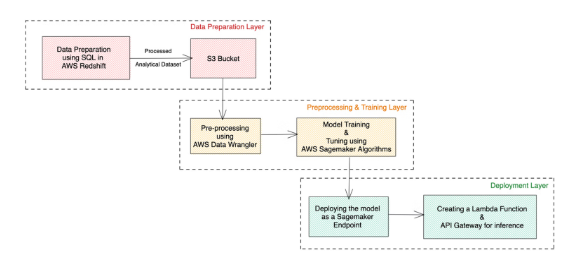

# HealthCare_Death_Predictions

End to End AWS pipeline classification model predicting a patient’s cause of death based on 2020 data
# Overview 
AWS (Amazon Web Services) is a comprehensive, evolving cloud computing platform
provided by Amazon that includes a mixture of infrastructure as a service (IaaS),
platform as a service (PaaS), and packaged software as a service (SaaS) offerings.
AWS services can offer organizations tools such as compute power, database storage,
and content delivery services. One of the important services of AWS is Amazon
sagemaker. Amazon sagemaker is a managed service on AWS cloud. It provides tools
to deploy any Machine Learning algorithm on the cloud for predictive analysis. Data
Scientist needs to deploy their built Machine Learning model in real-time, but they lack
software engineering skills and rely on software engineers to deploy their model.
In this project, a classification model predicting the cause of death has been built on
AWS using the service amazon sagemaker. AWS services like sagemaker,
datawrangler, and lambda have been used in this project.
# Aim
* To understand the working of AWS
* To build a classification model predicting a patient’s cause of death
## Data Description
The data provided is for 2020 death cases. There are 16 features available with case
number as a unique identifier and Reason of Death as a target variable. The Data
dictionary is attached with the data.
## Tech Stack
* Language: Python
* Libraries: pytorch, pandas, numpy, regex,boto3, seaborn, sagemaker, matplotlib
* Services used- AWS lambda, AWS sagemaker, Datawrangler